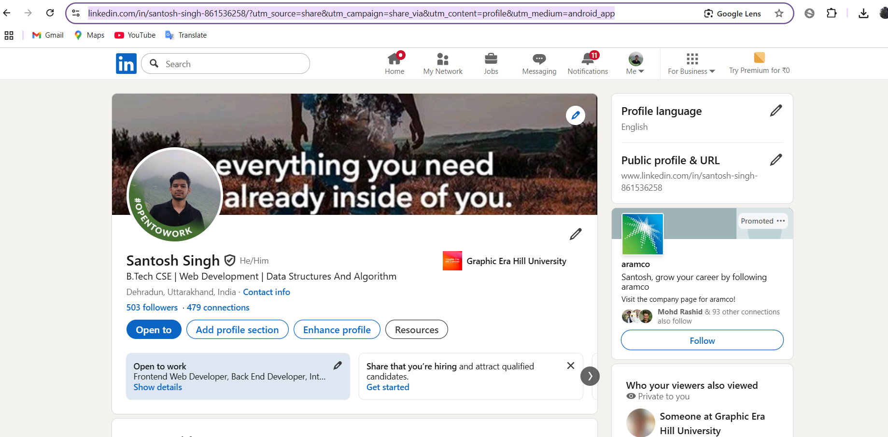
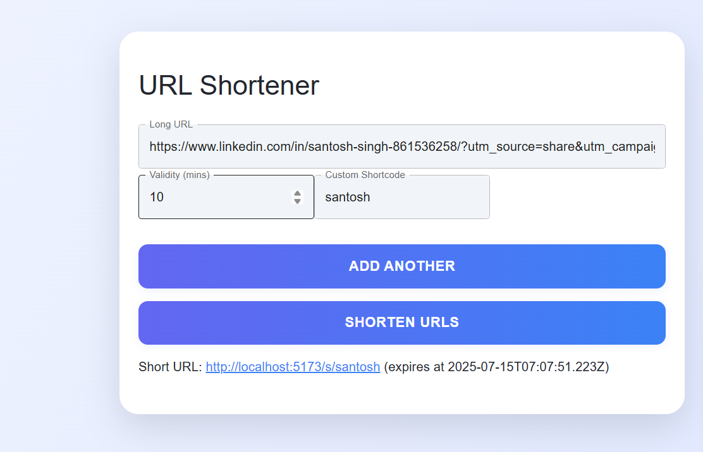

# 🔗 URL Shortener Web App

This is a frontend-only **URL Shortener application** built using **React (Vite)** and **Material UI**, developed as part of the AffordMed Campus Evaluation.

It allows users to shorten long URLs, optionally specify expiration, provide custom shortcodes, and view analytics — all within the browser using client-side logic.

---

## 🚀 Features

- Shorten up to **5 URLs** at once
- Set optional **expiry time** (default: 30 minutes)
- Use **custom shortcodes** or auto-generate them
- Client-side **redirection** of short URLs
- Track:
  - Total number of clicks
  - Click timestamps
  - Click sources (referrer)
  - Approximate geo-location
- Built with **React (Vite)** and **Material UI**
- Uses **custom Logging Middleware** — no `console.log` used

---

## ⚙️ Tech Stack

- React (Vite)
- JavaScript
- Material UI

---

## 📸 Screenshots




example
input url: "https://www.linkedin.com/in/santosh-singh-861536258/?utm_source=share&utm_campaign=share_via&utm_content=profile&utm_medium=android_app"

output url: "http://localhost:5173/s/santosh"


## 🛠️ Setup Instructions

Clone the repo and run locally:

```bash
git clone https://github.com/11SantoshSingh/2219559.git
cd 2219559
npm install
npm run dev
